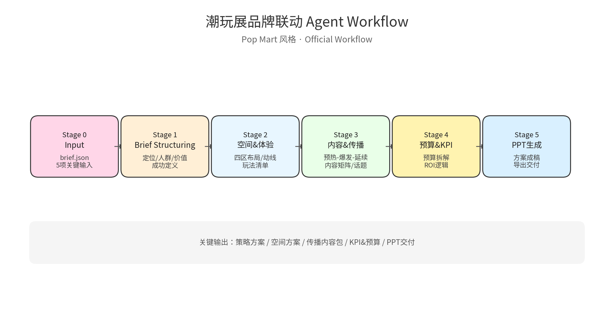

# 「潮玩展品牌联动 Agent」
## Official Agent Workflow Design（发布版）

**定位一句话**
> 一个面向【商场 / 文旅 / 潮玩展】的品牌联动策划 → 内容生成 → PPT 交付 的实用型 Agent Workflow。

**核心能力一句话**
> 输入 5 个关键信息，48 小时内交付一套可落地的潮玩展品牌联动方案（含 PPT）。

---

## Workflow 总览（五阶段）
**Agent ID:** `exhibition_brand_collab_agent`

```
Input
↓
Stage 1｜Brief Structuring
↓
Stage 2｜Spatial & Experience Design
↓
Stage 3｜Content & 传播策略
↓
Stage 4｜Budget & KPI Mapping
↓
Stage 5｜PPT Generation & Export
```

---

## Stage 0｜Input（人类输入）
**必填 5 项**
1. 联动品牌类型（潮玩 / 本地 IP / 饮品 / 数码）
2. 预算区间
3. 活动周期
4. 核心目标优先级（引流 / 声量 / 转化）
5. 场地类型（商场 / 展馆 / 中庭）

**输出格式：** `brief.json`

---

## Stage 1｜Brief Structuring
**Agent 作用：**把“人话”变成“策划语言”。

**输出：**
```json
{
  "event_positioning": "...",
  "target_audience": "...",
  "core_value": "...",
  "success_definition": "..."
}
```

---

## Stage 2｜空间与体验设计 Agent（核心亮点）
**固定结构：**
- IP 展陈区
- 互动打卡区
- 销售转化区
- 舞台 / KOL 区

**输出：**
- 四区布局说明
- 动线逻辑
- 单点玩法清单

---

## Stage 3｜传播与内容 Agent（泡泡玛特式三段）
1. 预热期（T-7 ~ T-1）
2. 爆发期（D1 ~ D3）
3. 延续期（T+1 ~ T+7）

**输出：**
- 内容类型矩阵
- KOL / UGC 触发机制
- 话题结构

---

## Stage 4｜预算 & KPI Agent
**硬指标化输出：**
- 预算拆解（场地 / 展陈 / 传播 / 人力）
- KPI 对应预算项
- ROI 逻辑说明

---

## Stage 5｜PPT Generation & Export
**交付结果：**
- PPT 方案成稿
- 导出交付（可对外展示）

---

## 视觉与文件
- `agent-workflow-popmart.png`：高清流程图（推荐用于汇报/展示）
- `agent-workflow-popmart.svg`：矢量版，便于二次编辑


